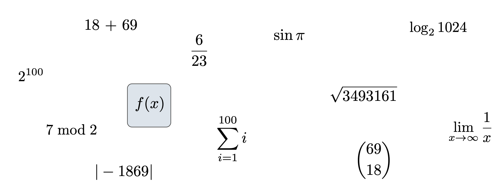
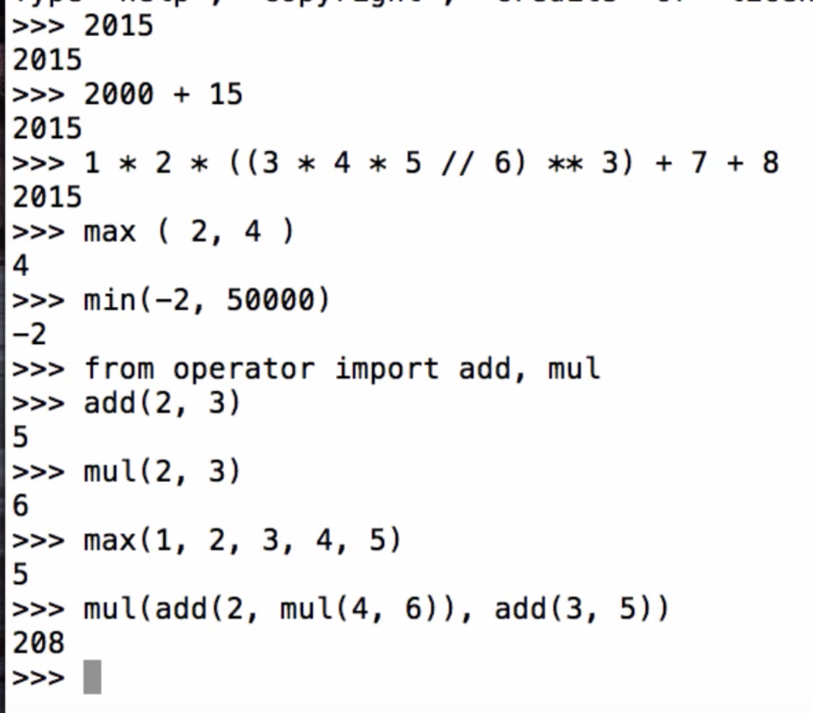
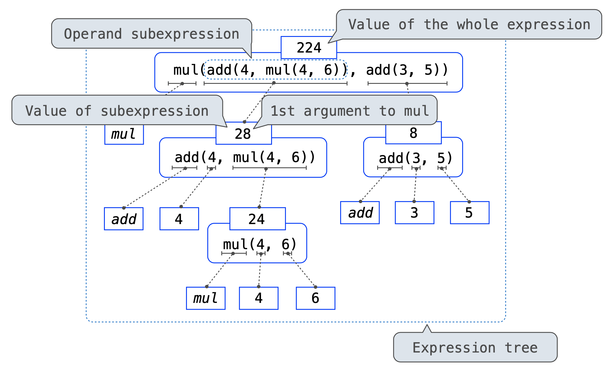

# 1. Expressions

## Expressions

### Types of Expressions

* An expression describes a computation and evaluates to a value

### Call Expressions in Python

* Call expresion is powerful

### Anatomy of a Call Expression

* Operators and operands are also expressions
* So they evaluate to values
* Evaluation procedure for call expressions:
  1. Evaluate the operator and then the operand subexpressions
  2. **Apply** the **function** that is the value of the operator to the **arguments** that are the values of operands

### Evaluating Nested Expressions

