# 2. Environment Diagram

## Environment Diagrams

* Environment diagrams visualize the interpreter's process

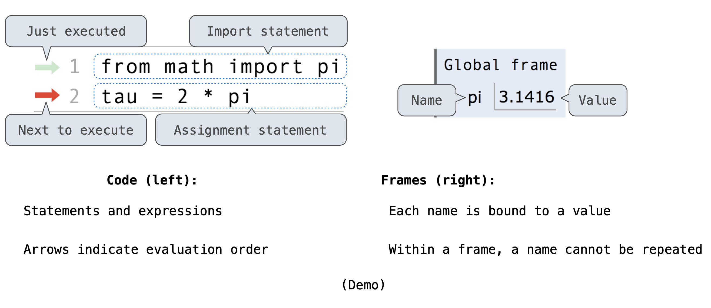

* Within a frame, a name cannot be repeated means it has to be bound to **at most one value**
  * For example, if we set max = 7, then old binding was lost

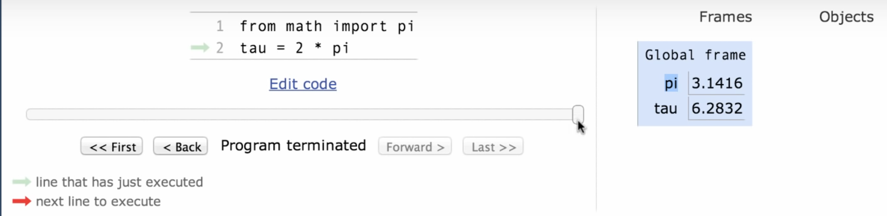

## Assignment Statements

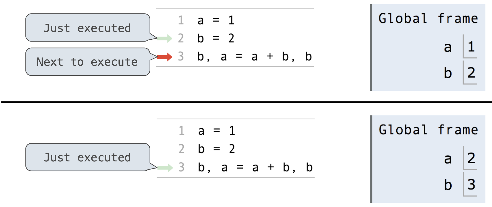

* Execution rule for assignment statements:
* 1. Evaluate all expressions to the right of = from left to right
  2. Bind all names to the left of = to those resulting values in the current frame

## Discussion Question 1 Solution

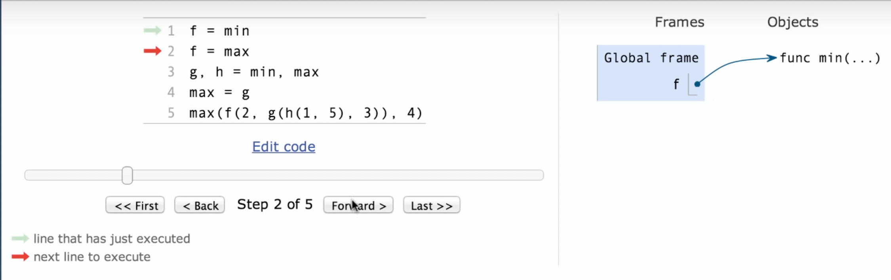

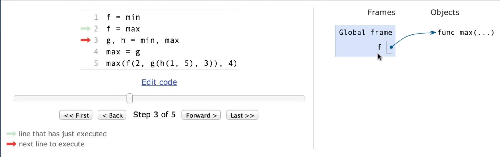

* Since within a frame, it has to be bound to **at most one value,** f is now bounded to function max\(...\)

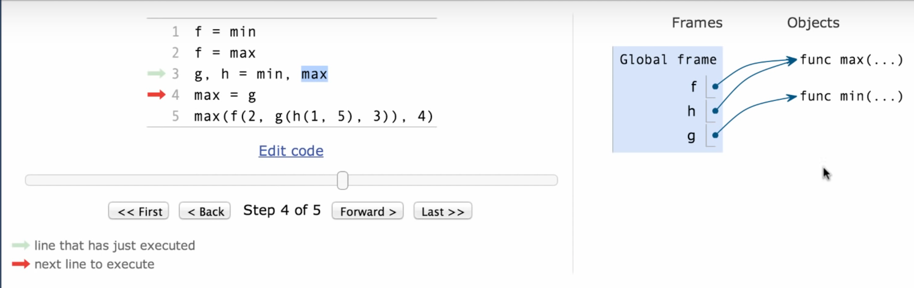

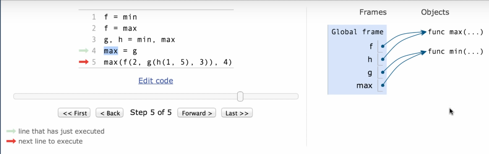

* Since g is min, because of L4, max goes to min also

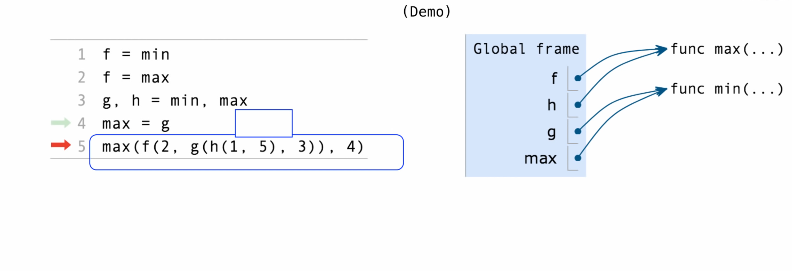

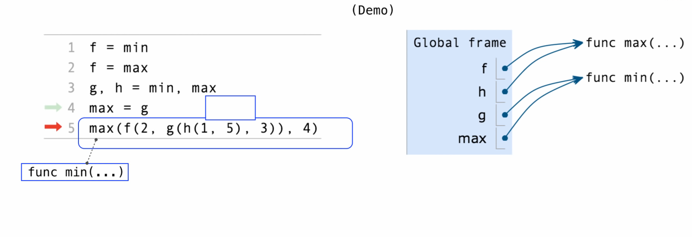

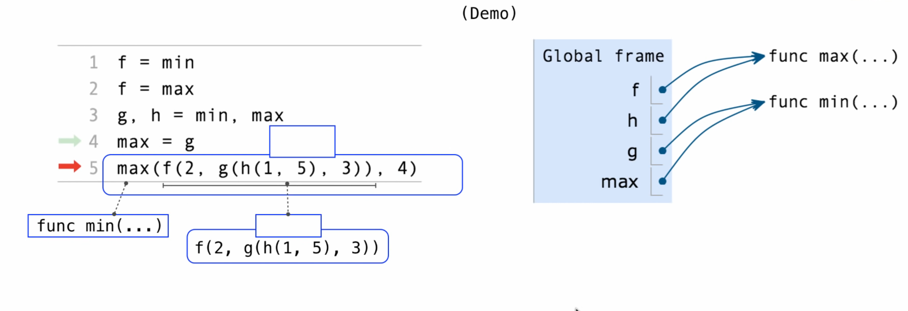

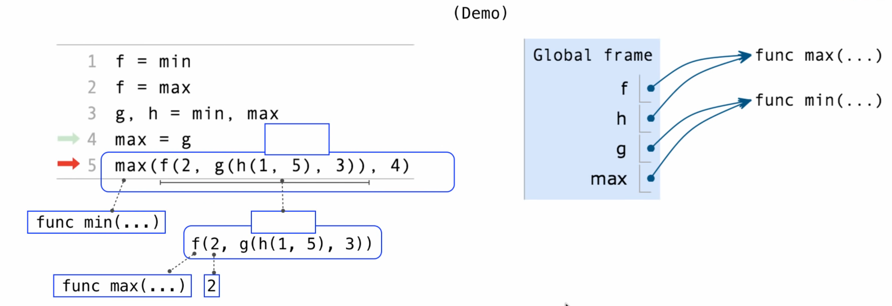

 

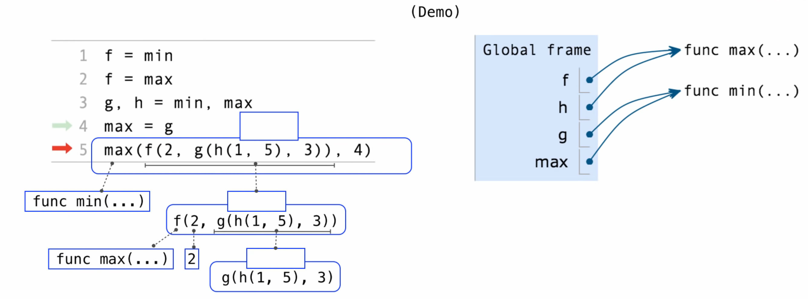

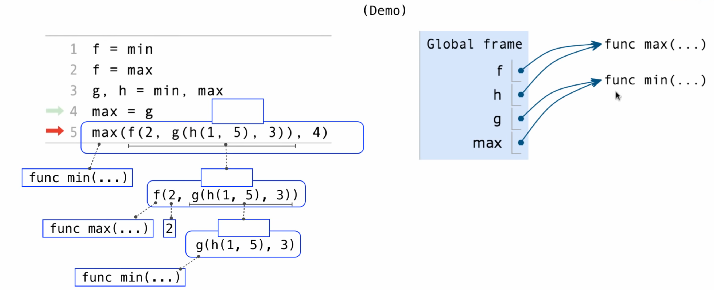

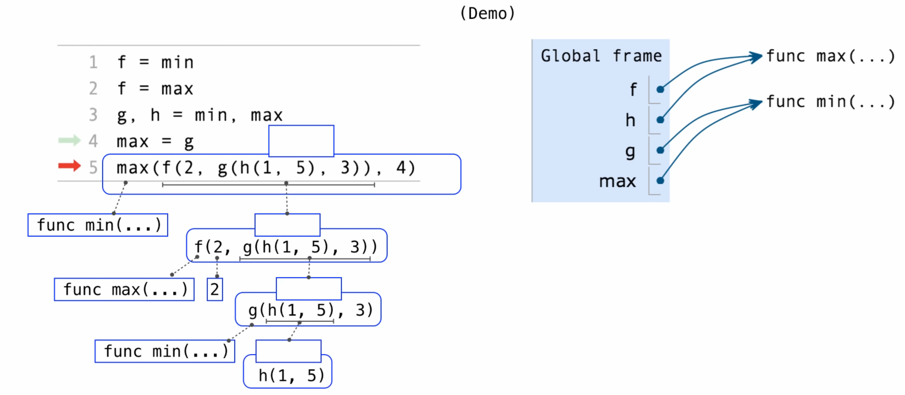

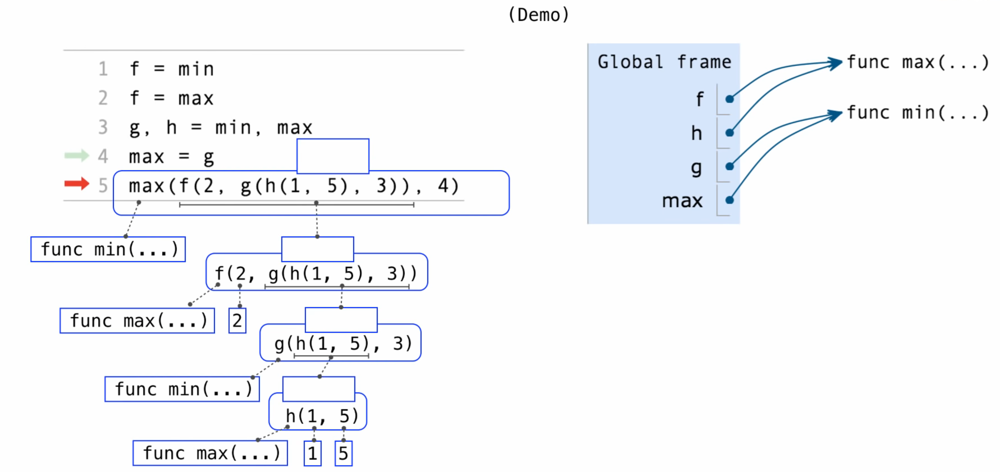

 

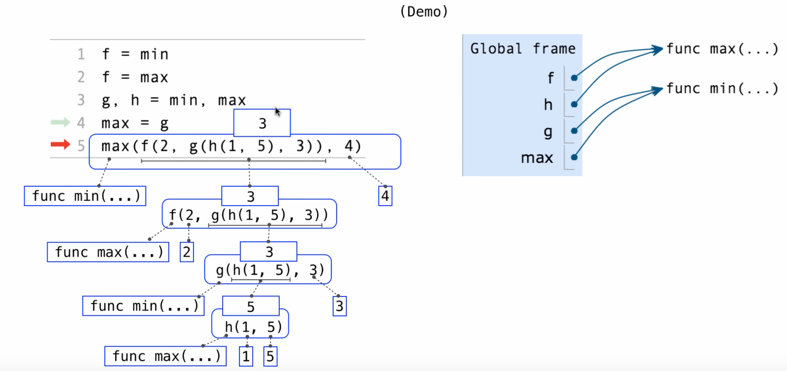

* Therefore, the answer is 3

