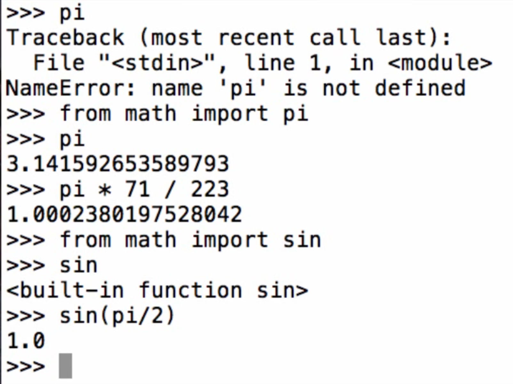

# 1. Names, Assignment, and User-Defined Functions

## Names, Assignment, and User-Defined Functions

## Detour: Types of Expressions

### Primitive expressions:

### Call expressions:

### Then, now we interested in how Name works

## Discussion Question 1

* What is the value of the final expression in this sequence?
  * &gt;&gt;&gt; f = min
  * &gt;&gt;&gt; f = max
  * &gt;&gt;&gt; g, h = min, max
  * &gt;&gt;&gt; max = g
  * &gt;&gt;&gt; max\(f\(2, g\(h\(1, 5\), 3\)\), 4\)
* 3

