# 3. Defining Functions

## Defining Functions

* **Assignment** is a simple means of abstraction \(Showing simple, hiding details\): binds names to values
* **Function definition** is more powerful means of abstraction: binds names to expressions

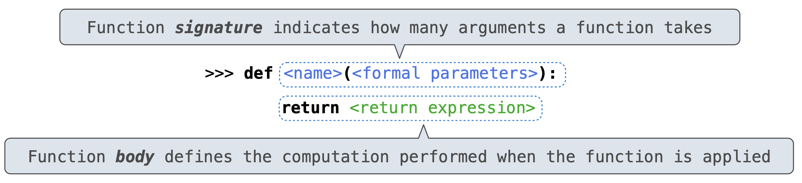

* Execution procedure for def statements:
* 1. Create a function with signature  &lt;name&gt;\(&lt;formal parameters&gt;\)
  2. Set the body of that function to be everything indented after the first line
     1. i.e. body will not executed until the function call
  3. Bind &lt;name&gt; to that function in the current frame

## Calling User-Defined Functions

* Procedure for calling/applying user-defined functions  \(version 1\):
* 1. Add a local frame, forming a new environment
  2. Bind the function's formal parameters to its arguments in that frame
  3. Execute the body of the function in that new environment

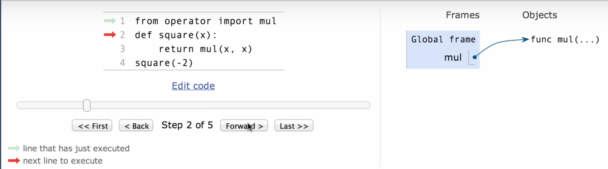

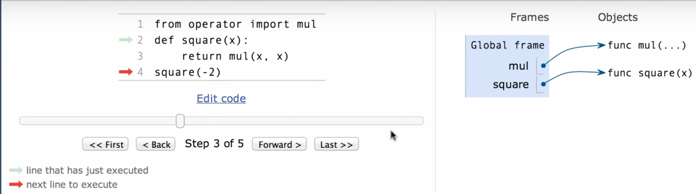

* Bind the name 'square′ to the function we created in the current environment

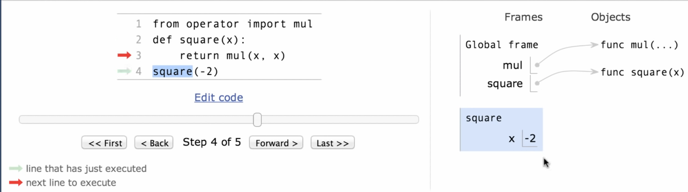

* 1. Add a local frame, which is square forming a new environment
  2. Bind the formal parameter 'x' to the argument value '-2′ in that new frame 'square′
  3. Then, execute the body of the function in that new environment

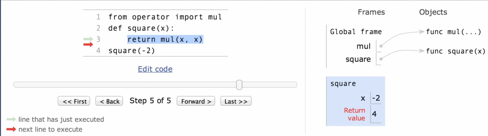

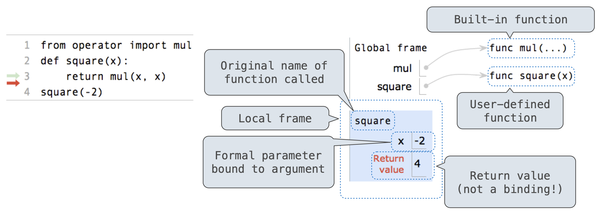

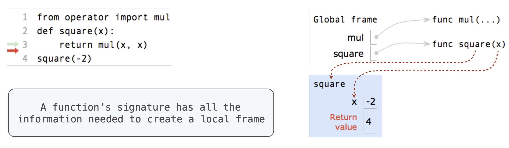

## Looking Up Names in Environments

* Every expression is evaluated in the context of an environment.
* So far, the **current environment** is either:
  * The **global frame** alone, or
  * A **local frame**, followed by the global frame
* **Most important two things I'll say all day:**
* 1. An environment is a sequence of frames
  2. A name evaluates to the value bound to that name in the earliest frame of the current environment in which that name is found
* For example, to look up some name in the body of the square function:
  * Look for that name in the local frame.
    * If it is there, we know its value, so you don't need to look for it in the global frame
    * If not found, look for it in the global frame \(Built-in names like "max" are in the global frame too, but we don't draw them in environment diagram\)

### Example

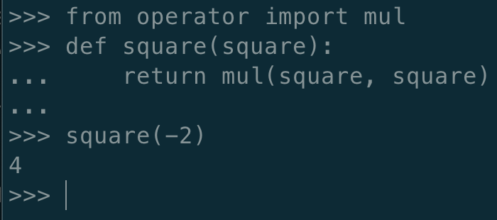

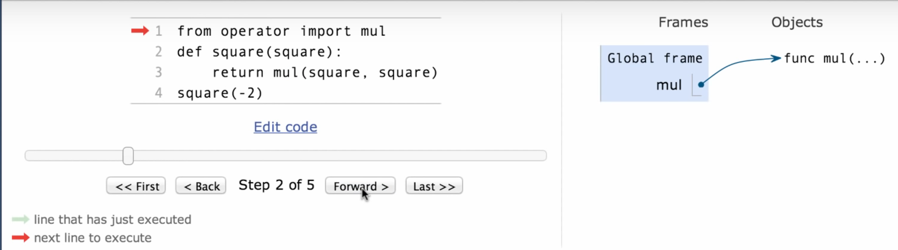

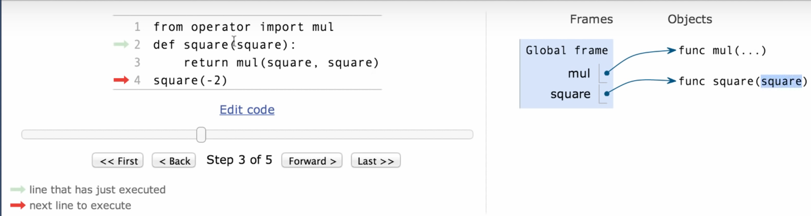

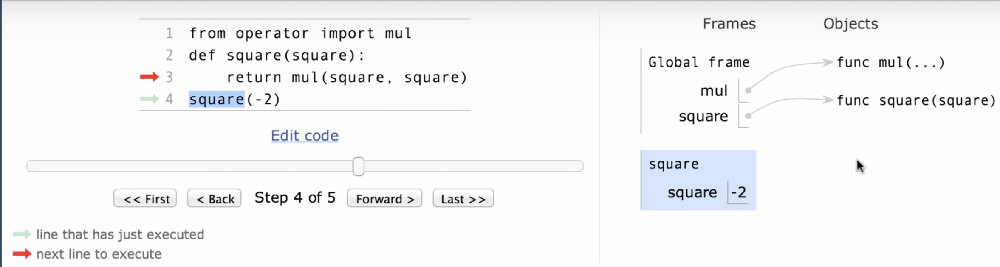

* When I call the 'square′ function, I look up the function I name it the local frame 'square'
* Then, I bind the argument '-2′ to the name square which is formal parameter
* Since after loop up the name in the local frame and I found the value '-2′, I don't need to loop for global frame

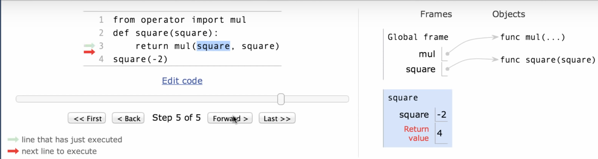

